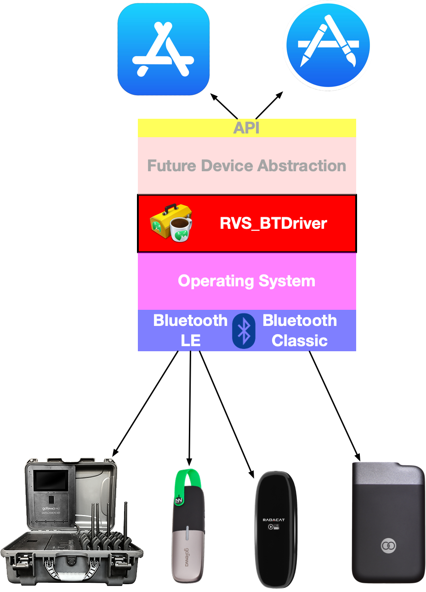
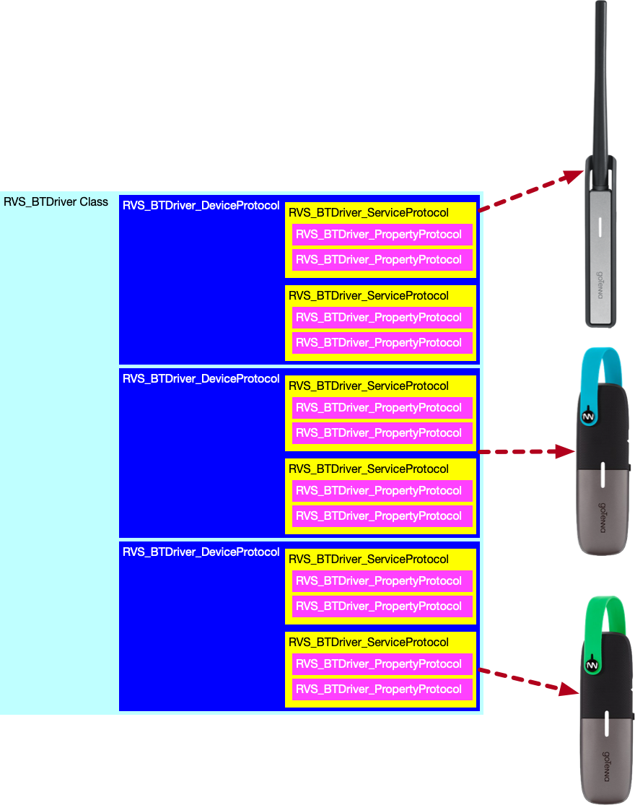

RVS_BTDriver PUBLIC API DOCUMENTATION
=
This project is an open-source, low-level native Cocoa ([iOS](https://apple.com/ios), [macOS](https://apple.com/macos), [watchOS](https:apple.com/watchos) and [tvOS](https://apple.com/tvos)) [BLE (**B**luetooth **L**ow **E**nergy)](https://www.bluetooth.com) driver for mesh communication devices, like the  [goTenna](https://gotenna.com) devices.

Internal Documentation Links:
-
**A DEEPER DIVE:**

- [This is the documentation site for the public project internals.](https://riftvalleysoftware.github.io/RVS_GTDriver/internal/)

**EXAMPLE PROJECTS:**

The four test harness projects, supplied with the driver, are designed to provide high-quality, easy-to-understand examples of using the driver:

- [The MacOS Test Harness Project](https://riftvalleysoftware.github.io/RVS_GTDriver/macOSTestHarness) *([GitHub Repo Directory](https://github.com/RiftValleySoftware/RVS_GTDriver/tree/master/RVS_BTDriver_MacOS_Test_Harness))*
- [The WatchOS Test Harness Project](https://riftvalleysoftware.github.io/RVS_GTDriver/watchOSTestHarness) *([GitHub Repo Directory](https://github.com/RiftValleySoftware/RVS_GTDriver/tree/master/RVS_BTDriver_WatchOS_Test_Harness))*
- [The iOS/iPadOS Test Harness Project](https://riftvalleysoftware.github.io/RVS_GTDriver/iOSTestHarness) *([GitHub Repo Directory](https://github.com/RiftValleySoftware/RVS_GTDriver/tree/master/RVS_BTDriver_iOS_Test_Harness))*
- The TVOS Test Harness Project *([GitHub Repo Directory](https://github.com/RiftValleySoftware/RVS_GTDriver/tree/master/RVS_BTDriver_tvOS_Test_Harness))*

WHERE THIS DRIVER FITS
=

This is where the driver project fits in our system.

The driver is a low-level transport abstraction layer. It is Bluetooth-specific, but is designed to abstract between [Bluetooth LE](https://en.wikipedia.org/wiki/Bluetooth_Low_Energy) and Bluetooth BR/EDR ("Classic"); presenting a common object model of data and interactions with Bluetooth devices.

SIMPLE API
-
The job of the driver is to *abstract* the general Bluetooth structure, and present a set of [Swift Protocols](https://docs.swift.org/swift-book/LanguageGuide/Protocols.html), in a hierarchical arrangement.

The user of the API will instantiate an instance of `RVS_BTDriver`, which will, in turn, present collections of "devices" (`RVS_BTDriver_DeviceProtocol`), which will contain "Services" (`RVS_BTDriver_ServiceProtocol`), which will aggregate "properties" (`RVS_BTDriver_PropertyProtocol`).

EXAMPLE MENTAL MODEL OF THE DRIVER
-

This is an example of how the driver might present three goTenna devices (two Mesh devices and a Pro).

DEVICES, SERVICES, AND PROPERTIES ARE PROTOCOL INSTANCES
-
Even though, under the hood, devices, services and protocols (more on these in a minute) are class instances, they are presented to the API user as instances that conform to protocols. This allows maximum flexibility, for both the user and the driver developer.

**SYSTEM LAYOUT:**

As the mental model above shows, the `RVS_BTDriver` instance will have an internal Array of devices; each of which is presented as an instance that conforms to the `RVS_BTDriver_DeviceProtocol` protocol.
The driver instance can actually be iterated and subscripted directly in order to access these devices.

Each Device instance will have an internal Array of `RVS_BTDriver_ServiceProtocol` protocol-conformant instances.
The device can be subscripted, but not iterated.

Each Service instance will have an Array of `RVS_BTDriver_PropertyProtocol` protocol-confomant instances, representing the states and control points for services.
The service can be subscripted, but not iterated.

Once you instantiate the `RVS_BTDriver` instance, it will discover and list the devices, which will, in turn, discover and list services, which will discover and list properties (the equivalent of Bluetooth "characteristics").

Once a device has been added to the driver Array, it can be considered to have completed the discovery process entirely, and is ready for use.

REQUIREMENTS
-
The Driver is provided as a [Swift](https://developer.apple.com/swift/)-only shared dynamic [framework](https://developer.apple.com/library/archive/documentation/MacOSX/Conceptual/BPFrameworks/Frameworks.html).

This is meant for [iOS](https://www.apple.com/ios/), [macOS](https://www.apple.com/macos/), [watchOS](https://www.apple.com/watchos/), [tvOS](https://www.apple.com/tvos/) and [ipadOS](https://www.apple.com/ipados/) only.

USING THE DRIVER
-
In order to establish a connection to supported devices, you will need to include the driver module into your application:

**TODO - ADD DETAILS ON INTEGRATION**

You then need to instantiate the `RVS_BTDriver` class:

    let driverInstance = RVS_BTDriver(delegate: <REQUIRED: YOUR DELEGATE INSTANCE>,
                                         queue: <OPTIONAL: ALTERNATIVE DISPATCH QUEUE>,
                      allowDuplicatesInBLEScan: <OPTIONAL: TRUE IF WE ALLOW THE SCAN TO INCLUDE DUPLICATES>,
                                 stayConnected: <OPTIONAL: TRUE IF WE WANT THE DRIVER TO MAINTAIN A CONNECTION AFTER DISCOVERY AND INITIAL QUERY>)

The above parameters are:
- `delegate`: The delegate to be used with this instance. It cannot be nil, and is a weak reference.
- `queue`: This is a desired queue for the CB manager to operate from. It is optional, and default is nil (main queue).
- `allowDuplicatesInBLEScan`: This is a flag that specifies that the scanner can be continuously running, and "re-finding" duplicate devices.  If true, it could adversely affect battery life. Default is false.
- `stayConnected`:  This is set to true, if you want all your device connections to be persistent. That is, once connected, they must be explicitly disconencted by the user. Otherwise, each device will be connected only while interacting. This is optional. Default is false.

DELEGATION
-
At minimum, you need to have a delegate. The driver uses the [Delegation](https://en.wikipedia.org/wiki/Delegation_pattern) pattern and the [Observer](https://en.wikipedia.org/wiki/Observer_pattern) pattern to operate.

When you first instantiate the `RVS_BTDriver` class, you pass in a delegate object.

**Required Methods**

The delegate needs to be a Swift class, and there is one required method:

    func btDriver(_ driver: RVS_BTDriver, encounteredThisError: RVS_BTDriver.Errors)

The parameter signature for that is:

- `driver`: The `RVS_BTDriver` instance that encountered the error.
- `encounteredThisError`: The error that was encountered. This is a special enum, with associated values:
    - `bluetoothNotAvailable`  This is returned if the manager can't power on.
    - `connectionAttemptFailed(error: Error?)` This is returned if we cannot connect to the device. The associated value is any error that occurred.
    - `connectionAttemptFailedNoDevice` This is returned if we connected, but no device was available. This should never happen.
    - `disconnectionAttemptFailed(error: Error?)` This is returned if we cannot disconnect from the device. The associated value is any error that occurred.
    - `unknownDisconnectionError` This is a "catchall" error for a disconnection issue.
    - `unknownPeripheralDiscoveryError(error: Error?)` This is a "catchall" error for peripheral discovery. The associated value is any error that occurred.
    - `characteristicValueMissing` This means that we did not get a characteristic value.
    - `unknownCharacteristicsDiscoveryError(error: Error?)` This is a "catchall" error for characteristics discovery. The associated value is any error that occurred.
    - `unknownCharacteristicsReadValueError(error: Error?)` This is a "catchall" error for characteristics value read. The associated value is any error that occurred.
    - `unknownError(error: Error?)` This is a "catchall" error. The associated value is any error that occurred.

This method is called whenever an error is encountered at the driver (main instance) level.

**Optional Methods**

There are several optional (default does nothing) methods that it is highly recommended that you implement:

This method is called whenever a new device has been discovered, queried for its device info, and added to the internal list of devices.

Once this is called, the device can be considered added to the driver device Array.

    func btDriver(_ driver: RVS_BTDriver, newDeviceAdded: RVS_BTDriver_DeviceProtocol)

The parameter signature for that is:

- `driver`: The `RVS_BTDriver` instance calling this.
- `newDeviceAdded`: The device object, masked as a protocol.

This is called whenever the driver experiences a status change event. The event is not specified, so this should be considered a queue to examine the state of the driver object.

    func btDriverStatusUpdate(_ driver: RVS_BTDriver)

The parameter signature for that is:

- `driver`: The `RVS_BTDriver` instance calling this.

This is called if the scanning state of the driver changes.

It may be called frequently, and there may not be any changes. This is mereley a "make you aware of the POSSIBILITY of a change" call.

    func btDriverScanningChanged(_ driver: RVS_BTDriver, isScanning: Bool)

The parameter signature for that is:

- `driver`: The `RVS_BTDriver` instance calling this.
- `isScanning`: True, if the new state is scanning is on.

**ALL CALLBACKS CAN BE CALLED IN DIFFERENT THREADS**

There is no guarantee that callbacks to delegates or observers will be made in the main dispatch thread. This needs to be accounted for, when calling UI code.

OBSERVERS
-
Interaction with Devices and Services is done via [observers](https://en.wikipedia.org/wiki/Observer_pattern). You can subscribe one or more instances that conform to observer protocols to instances, and the observers will be notified of events and state changes.

**DEVICE OBSERVERS**
You subscribe to devices, using the `RVS_BTDriver_DeviceSubscriberProtocol` protocol. If you conform to this protocol, you can subscribe to an instance that conforms to `RVS_BTDriver_DeviceProtocol` via its `subscribe(_:)` method:

    func subscribe(_: RVS_BTDriver_DeviceSubscriberProtocol)

Where the parameter is the subscriber.

You unsubscribe by calling the `unsubscribe(_:)` method:

    func unsubscribe(_: RVS_BTDriver_DeviceSubscriberProtocol)

Where the parameter is the subscriber to be removed.

**Required Methods**

The observer needs to be a Swift class (not struct or enum), and there is one required method:

    func device(_ device: RVS_BTDriver_DeviceProtocol, encounteredThisError: RVS_BTDriver.Errors)

The parameter signature for that is:

- `device`: The `RVS_BTDriver_DeviceProtocol` instance that encountered the error.
- `encounteredThisError`: The error that was encountered. This is a special enum, with associated values:
    - `bluetoothNotAvailable`  This is returned if the manager can't power on.
    - `connectionAttemptFailed(error: Error?)` This is returned if we cannot connect to the device. The associated value is any error that occurred.
    - `connectionAttemptFailedNoDevice` This is returned if we connected, but no device was available. This should never happen.
    - `disconnectionAttemptFailed(error: Error?)` This is returned if we cannot disconnect from the device. The associated value is any error that occurred.
    - `unknownDisconnectionError` This is a "catchall" error for a disconnection issue.
    - `unknownPeripheralDiscoveryError(error: Error?)` This is a "catchall" error for peripheral discovery. The associated value is any error that occurred.
    - `characteristicValueMissing` This means that we did not get a characteristic value.
    - `unknownCharacteristicsDiscoveryError(error: Error?)` This is a "catchall" error for characteristics discovery. The associated value is any error that occurred.
    - `unknownCharacteristicsReadValueError(error: Error?)` This is a "catchall" error for characteristics value read. The associated value is any error that occurred.
    - `unknownError(error: Error?)` This is a "catchall" error. The associated value is any error that occurred.

**Optional Methods**

This is called When a service is added to the main list.

    func device(_ device: RVS_BTDriver_DeviceProtocol, serviceAdded: RVS_BTDriver_ServiceProtocol)
    
The parameter signature for that is:

- `device`: The `RVS_BTDriver_DeviceProtocol` instance that has the service
- `serviceAdded`: The `RVS_BTDriver_ServiceProtocol` service that was added.

This is called to indicate that the device's status should be checked.

It may be called frequently, and there may not be any changes. This is mereley a "make you aware of the POSSIBILITY of a change" call.

    func deviceStatusUpdate(_ device: RVS_BTDriver_DeviceProtocol)
    
The parameter signature for that is:

- `device`: The `RVS_BTDriver_DeviceProtocol` instance calling this.

**SERVICE OBSERVERS**
You subscribe to services, using the `RVS_BTDriver_ServiceSubscriberProtocol` protocol. If you conform to this protocol, you can subscribe to an instance that conforms to `RVS_BTDriver_ServiceProtocol` via its `subscribe(_:)` method:

    func subscribe(_: RVS_BTDriver_ServiceSubscriberProtocol)

Where the parameter is the subscriber.

You unsubscribe by calling the `unsubscribe(_:)` method:

    func unsubscribe(_: RVS_BTDriver_ServiceSubscriberProtocol)

Where the parameter is the subscriber to be removed.

**Required Methods**

The observer needs to be a Swift class (not struct or enum), and there is one required method:

    func service(_ service: RVS_BTDriver_ServiceProtocol, encounteredThisError: RVS_BTDriver.Errors)

The parameter signature for that is:

- `service`: The `RVS_BTDriver_ServiceProtocol` instance that encountered the error.
- `encounteredThisError`: The error that was encountered. This is a sp/Volumes/Development/RiftValley/RVS_GTDriver/Cartfileecial enum, with associated values:
    - `bluetoothNotAvailable`  This is returned if the manager can't power on.
    - `connectionAttemptFailed(error: Error?)` This is returned if we cannot connect to the device. The associated value is any error that occurred.
    - `connectionAttemptFailedNoDevice` This is returned if we connected, but no device was available. This should never happen.
    - `disconnectionAttemptFailed(error: Error?)` This is returned if we cannot disconnect from the device. The associated value is any error that occurred.
    - `unknownDisconnectionError` This is a "catchall" error for a disconnection issue.
    - `unknownPeripheralDiscoveryError(error: Error?)` This is a "catchall" error for peripheral discovery. The associated value is any error that occurred.
    - `characteristicValueMissing` This means that we did not get a characteristic value.
    - `unknownCharacteristicsDiscoveryError(error: Error?)` This is a "catchall" error for characteristics discovery. The associated value is any error that occurred.
    - `unknownCharacteristicsReadValueError(error: Error?)` This is a "catchall" error for characteristics value read. The associated value is any error that occurred.
    - `unknownError(error: Error?)` This is a "catchall" error. The associated value is any error that occurred.

**Optional Methods**

This is called When a property is added to the main list.

    func service(_ service: RVS_BTDriver_ServiceProtocol, propertyAdded: RVS_BTDriver_PropertyProtocol)

- `service`: The `RVS_BTDriver_ServiceProtocol` instance that has the service.
- `propertyAdded`: The `RVS_BTDriver_PropertyProtocol` property that was added.

This is called to indicate that the services's status should be checked.

It may be called frequently, and there may not be any changes. This is mereley a "make you aware of the POSSIBILITY of a change" call.

    func serviceStatusUpdate(_ service: RVS_BTDriver_ServiceProtocol)

The parameter signature for that is:

- `service`: The `RVS_BTDriver_ServiceProtocol` instance that called this.

This is called to indicate that the state of a property "owned" by the service has changed state.

    func propertyStatusUpdate(_ service: RVS_BTDriver_ServiceProtocol, property: RVS_BTDriver_PropertyProtocol)

The parameter signature for that is:

- `service`: The `RVS_BTDriver_ServiceProtocol` instance that called this.
- `property`: The `RVS_BTDriver_PropertyProtocol` instance that changed state.

LICENSE
-
© Copyright 2019, [The Great Rift Valley Software Company](https://riftvalleysoftware.com)

[MIT License](https://opensource.org/licenses/MIT)

Permission is hereby granted, free of charge, to any person obtaining a copy of this software and associated documentation
files (the "Software"), to deal in the Software without restriction, including without limitation the rights to use, copy,
modify, merge, publish, distribute, sublicense, and/or sell copies of the Software, and to permit persons to whom the
Software is furnished to do so, subject to the following conditions:

The above copyright notice and this permission notice shall be included in all copies or substantial portions of the Software.

THE SOFTWARE IS PROVIDED "AS IS", WITHOUT WARRANTY OF ANY KIND, EXPRESS OR IMPLIED, INCLUDING BUT NOT LIMITED TO THE WARRANTIES
OF MERCHANTABILITY, FITNESS FOR A PARTICULAR PURPOSE AND NONINFRINGEMENT.
IN NO EVENT SHALL THE AUTHORS OR COPYRIGHT HOLDERS BE LIABLE FOR ANY CLAIM, DAMAGES OR OTHER LIABILITY, WHETHER IN AN ACTION OF
CONTRACT, TORT OR OTHERWISE, ARISING FROM, OUT OF OR IN CONNECTION WITH THE SOFTWARE OR THE USE OR OTHER DEALINGS IN THE SOFTWARE.
