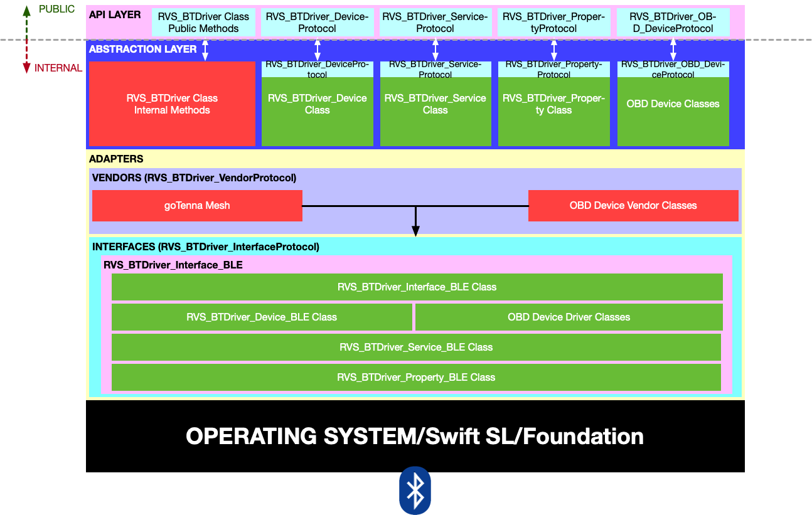

RVS_BTDriver (in GitHub as RVS_GTDriver, for Historical Reasons)
=
This project is an open-source, low-level native Cocoa ([iOS](https://apple.com/ios), [macOS](https://apple.com/macos), [watchOS](https:apple.com/watchos) and [tvOS](https://apple.com/tvos)) [BLE (**B**luetooth **L**ow **E**nergy)](https://www.bluetooth.com) driver for mesh communication devices, like the  [goTenna](https://gotenna.com) devices.

Documentation Links:
-

- [This is the documentation site for the public API.](https://riftvalleysoftware.github.io/RVS_GTDriver/)
- [This is the documentation site for the public project internals.](https://riftvalleysoftware.github.io/RVS_GTDriver/internal/)

WHERE THIS DRIVER FITS
=

This is where the driver project fits in our system.

The driver is a low-level transport abstraction layer. It is Bluetooth-specific, but is designed to abstract [Bluetooth LE](https://en.wikipedia.org/wiki/Bluetooth_Low_Energy); presenting a common object model of data and interactions with Bluetooth devices.

NOT A DEVICE DRIVER 
-
RVS_BTDriver is a low-level native Swift (Apple) driver. It is not a "device driver," which usually sit at an operating system level (kernel or user space). It is designed to translate between a bluetooth connection to a device, and a user application; presenting an object model of the device.

CENTRAL MANAGER
-
The driver will act as [a Bluetooth LE "central Manager" (GATT Client)](https://developer.apple.com/documentation/corebluetooth/cbcentralmanager) only. It will not present itself as [a peripheral](https://developer.apple.com/documentation/corebluetooth/cbperipheral).

SYSTEM ARCHITECTURE
=

The general class and protocol structure of the system.

SIMPLE API
-
The job of the driver is to *abstract* the general Bluetooth structure, and present a set of [Swift Protocols](https://docs.swift.org/swift-book/LanguageGuide/Protocols.html), in a hierarchical arrangement.

The user of the API will instantiate an instance of RVS_BTDriver, which will, in turn, present collections of "devices" (RVS_BTDriver_DeviceProtocol), which will contain "Services" (RVS_BTDriver_ServiceProtocol), which will aggregate "properties" (RVS_BTDriver_PropertyProtocol).

EXAMPLE MENTAL MODEL OF THE DRIVER
-

This is an example of how the driver might present three goTenna devices (two Mesh devices and a Pro).

DEVICES, SERVICES, AND PROPERTIES ARE PROTOCOL INSTANCES
-
Even though, under the hood, devices, services and protocols are class instances, they are presented to the API user as instances that conform to protocols. This allows maximum flexibility, for both the user and the driver developer.

**SYSTEM LAYOUT:**

As the mental model above shows, the BT_Driver instance will have an internal Array of devices; each of which is presented as an instance that conforms to the `RVS_BTDriver_DeviceProtocol` protocol.
The driver instance can actually be iterated and subscripted directly in order to access these devices.

Each Device instance will have an internal Array of `RVS_BTDriver_ServiceProtocol` protocol-conformant instances.
The device can be subscripted, but not iterated.

Each Service instance will have an Array of `RVS_BTDriver_PropertyProtocol` protocol-confomant instances, representing the states and control points for services.
The service can be subscripted, but not iterated.

Once you instantiate the `RVS_BTDriver` instance, it will discover and list the devices, which will, in turn, discover and list services, which will discover and list properties (the equivalent of Bluetooth "characteristics").

Once a device has been added to the driver Array, it can be considered to have completed the discovery process entirely, and is ready for use.

REQUIREMENTS
-
The Driver is provided as a [Swift](https://developer.apple.com/swift/)-only shared dynamic [framework](https://developer.apple.com/library/archive/documentation/MacOSX/Conceptual/BPFrameworks/Frameworks.html).

This is meant for [iOS](https://www.apple.com/ios/), [macOS](https://www.apple.com/macos/), [watchOS](https://www.apple.com/watchos/), [tvOS](https://www.apple.com/tvos/) and [ipadOS](https://www.apple.com/ipados/) only.

LICENSE
-
© Copyright 2019, [The Great Rift Valley Software Company](https://riftvalleysoftware.com)

[MIT License](https://opensource.org/licenses/MIT)

Permission is hereby granted, free of charge, to any person obtaining a copy of this software and associated documentation
files (the "Software"), to deal in the Software without restriction, including without limitation the rights to use, copy,
modify, merge, publish, distribute, sublicense, and/or sell copies of the Software, and to permit persons to whom the
Software is furnished to do so, subject to the following conditions:

The above copyright notice and this permission notice shall be included in all copies or substantial portions of the Software.

THE SOFTWARE IS PROVIDED "AS IS", WITHOUT WARRANTY OF ANY KIND, EXPRESS OR IMPLIED, INCLUDING BUT NOT LIMITED TO THE WARRANTIES
OF MERCHANTABILITY, FITNESS FOR A PARTICULAR PURPOSE AND NONINFRINGEMENT.
IN NO EVENT SHALL THE AUTHORS OR COPYRIGHT HOLDERS BE LIABLE FOR ANY CLAIM, DAMAGES OR OTHER LIABILITY, WHETHER IN AN ACTION OF
CONTRACT, TORT OR OTHERWISE, ARISING FROM, OUT OF OR IN CONNECTION WITH THE SOFTWARE OR THE USE OR OTHER DEALINGS IN THE SOFTWARE.
